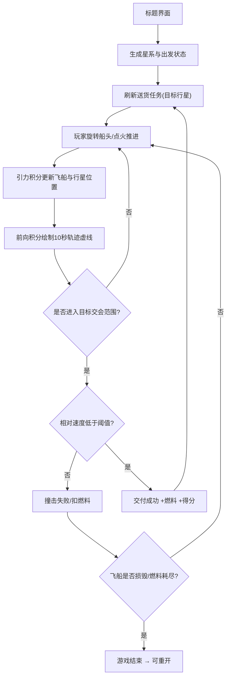

# 深空快递 (Deep Space Express) — 产品需求文档

## 1. 产品概述

一款硬核的“牛顿轨道力学”太空送货小游戏。玩家驾驶一艘燃料紧缺的小飞船，在恒星与公转行星构成的引力场中完成送货任务。飞行不靠直线推进，而是依靠真实的万有引力、引力弹弓与近日点变轨，并实时预测未来十秒的飞行轨迹。

- 主要目的：在真实物理（手搓牛顿引力 + Verlet 积分）下，体验“算准了再点火”的硬核飞行快感。
- 目标用户：喜欢《坎巴拉太空计划》式硬核物理、轨道力学、引力弹弓的玩家。
- 价值：纯 Canvas + TypeScript 实现的单文件可玩硬核物理玩具，无任何外部物理引擎依赖。

## 2. 核心功能

### 2.1 用户角色
不适用。单机游戏，玩家即“快递员驾驶员”。

### 2.2 功能模块
1. **游戏主场景**：俯视角星系（1 颗恒星 + 多颗公转行星）、飞船、轨迹预测虚线、星空背景。
2. **开始/结算覆盖层**：标题界面、操作说明、任务结算与游戏结束界面。

### 2.3 页面详情

| 页面名称 | 模块名称 | 功能描述 |
|-----------|-------------|---------------------|
| 游戏主场景 | 天体系统 | 恒星居中，行星按开普勒近似圆轨道公转，各自带质量与引力场 |
| 游戏主场景 | 飞船控制 | A/D 或 ←/→ 旋转船头，W 或 ↑ 点火推进；燃料有限 |
| 游戏主场景 | 轨迹预测 | 每帧基于当前速度矢量与引力场前向积分约 10 秒，绘制虚线；点火时虚线实时变形 |
| 游戏主场景 | 送货任务 | 随机刷新目标行星；需低速切入其轨道交会范围，速度过快即撞击失败 |
| 游戏主场景 | HUD | 燃料、速度、相对目标速度、当前任务、得分/已交付数、燃料补给提示 |
| 开始/结算覆盖层 | 流程 | 标题与操作说明、任务成功/失败提示、燃料耗尽/撞击导致的游戏结束与重开 |

## 3. 核心流程

玩家从“出发行星”附近起步，系统指定一个目标行星作为送货目的地。玩家通过旋转船头并间歇点火，借助恒星与行星的引力调整轨道，朝目标行星机动。接近目标时需减速到交会阈值内完成交付；若相对速度过高则撞击失败。完成交付可补充燃料并提升得分。燃料耗尽且无法抵达任何行星、或撞击导致损毁，则游戏结束。

## 4. 用户界面设计

### 4.1 设计风格
- 主题：深空 / 任务控制台 (Mission Control)。深蓝近黑背景，霓虹青色 (#5ef2ff) 主色 + 琥珀色 (#ffb454) 警示色。
- 按钮：极简线框风，细边框 + 发光 hover，等宽字体。
- 字体：HUD 与数字使用技术感等宽字体（如 "Share Tech Mono" / "JetBrains Mono"）；标题使用有辨识度的展示字体。
- 布局：满屏 Canvas，HUD 半透明叠层分布于四角；轨迹虚线为发光渐变色（按预测速度变色）。
- 图标/装饰：星体带柔光晕与大气层；飞船为几何三角形 + 推进尾焰粒子。

### 4.2 页面设计概览

| 页面名称 | 模块名称 | UI 元素 |
|-----------|-----------|---------|
| 游戏主场景 | 星空背景 | 多层视差星点、暗色径向渐变 |
| 游戏主场景 | 天体渲染 | 恒星光晕、行星本体与轨道细环、目标行星高亮环 |
| 游戏主场景 | 轨迹虚线 | 渐变发光虚线，按预测速度由青转红，点火时变形 |
| 游戏主场景 | HUD | 左上任务、右上得分/已交付、左下燃料条、右下速度矢量与目标距离 |
| 覆盖层 | 标题/结算 | 半透明遮罩、标题字体、操作键位提示、重开按钮 |

### 4.3 响应式
桌面优先，键盘操控。Canvas 自适应窗口尺寸并保持像素比清晰；小屏时 HUD 字号自适应缩小。触屏不做主要适配（硬核键盘玩法）。

### 4.4 3D 场景
不适用。纯 2D Canvas 俯视角渲染。
