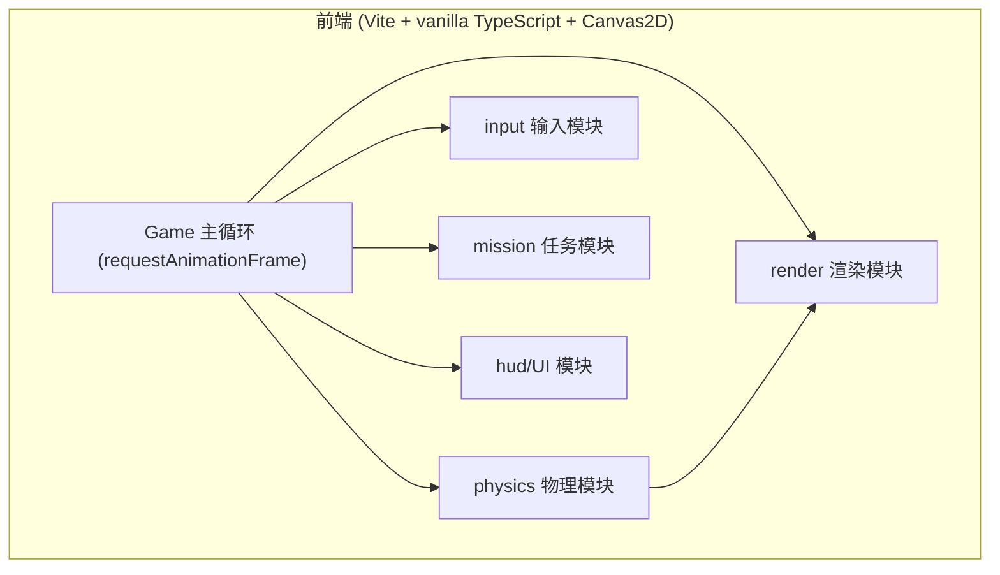
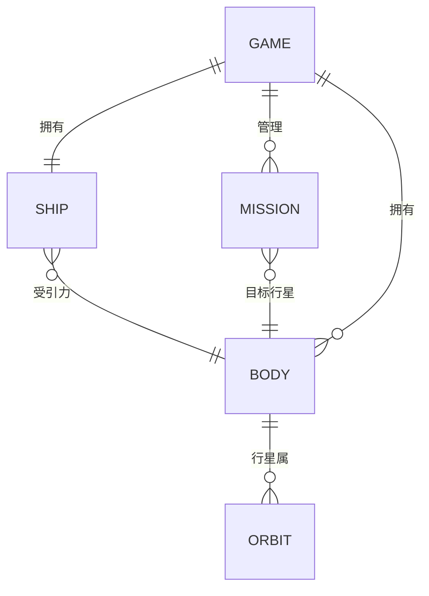

# 深空快递 (Deep Space Express) — 技术架构文档

## 1. 架构设计

纯前端单页 Canvas 游戏，无后端、无数据库、无外部物理引擎。所有物理与渲染在浏览器本地完成。



模块职责：
- `physics`：天体引力计算、飞船积分更新、前向轨迹预测（核心硬核逻辑）。
- `entities`：恒星、行星、飞船的数据结构与状态。
- `render`：Canvas 绘制（星空、星体、飞船、轨迹、尾焰）。
- `input`：键盘事件（旋转/点火/重开）。
- `mission`：任务刷新、交会判定、撞击判定、燃料与得分结算。
- `game`：主循环、状态机（标题/进行/结束）、整体编排。

## 2. 技术说明
- 前端：vanilla TypeScript + Canvas2D（不使用 React/Vue，满足“纯 Canvas 加 TS”要求）。
- 构建工具：Vite（vanilla-ts 模板）。
- 物理实现：手搓牛顿万有引力 `F = G·m1·m2 / r²`，引力软化避免奇点；积分采用 **velocity Verlet**（比朴素欧拉更稳定、能量守恒更好），轨迹预测复用同一积分器前向模拟。
- 状态：无全局状态库，模块间通过主 `Game` 对象传递引用（小游戏无需 zustand）。
- 依赖：仅 vite + typescript 开发依赖，运行时零依赖。

## 3. 路由定义
不适用。单页应用，无路由；通过游戏状态机切换标题/进行/结束覆盖层。

## 4. API 定义
不适用。无后端。

## 5. 服务器架构
不适用。纯前端。

## 6. 数据模型

### 6.1 数据模型定义



### 6.2 核心类型定义 (TypeScript)

```ts
interface Body {
  id: string;
  name: string;
  mass: number;          // 质量
  radius: number;        // 碰撞/可视半径
  pos: Vec2;             // 位置
  vel: Vec2;             // 速度
  color: string;
  isStar: boolean;       // 是否恒星(恒星固定/不积分位置)
  orbitRadius?: number;  // 公转半径(行星)
  orbitAngle?: number;   // 当前公转角
  orbitSpeed?: number;   // 公转角速度
}

interface Ship {
  pos: Vec2; vel: Vec2;
  heading: number;       // 船头朝向(弧度)
  thrust: number;        // 推力大小
  fuel: number;          // 剩余燃料
  maxFuel: number;
  alive: boolean;
}

interface Mission {
  targetId: string;      // 目标行星 id
  reward: number;        // 得分奖励
  state: 'active' | 'done' | 'failed';
}

interface Vec2 { x: number; y: number; }
```

### 6.3 物理参数（游戏化常量，非真实 SI，但遵循同构关系）
- 引力常数 G：可调，取使手感合理的值。
- 引力软化 ε：`r² + ε²` 防止近距奇点。
- 积分步长 dt：固定步长（如 1/120 s），主循环用累加器做多子步以保证稳定。
- 轨迹预测：复用 Verlet，前向 N 步 ≈ 10 秒；每帧重算，点火时输入推力使虚线变形。
